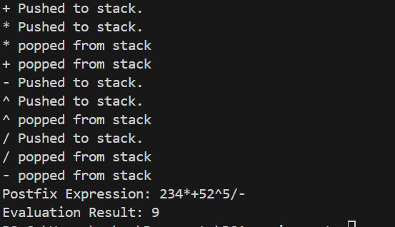

Q.2 Write a program to convert an infix mathematical expression to postfix and evaluate it.

First, we include all the header files. We use two stacks to solve this problem. The first stack is used in conversion of infix mathematical expression to postfix and the evalStack is used in the evaluation of the postfix mathematical expression. All the necessary stack functions are defined. 

For the conversion of infix mathematical expression to postfix we have declared a function called checkExpression(). This function runs till a null value is found in the expression. First, it checks for open paranthesis and pushes it to the stack. Then, it checks for close paranthesis and if found then it pops the stack and places the value in postfixExp array till the stack is not empty and an open paranthesis is not found. It also removes the open paranthesis if found. If an operator is found then it checks the precedence of the operator. To check the precedence we have created a precedence() function. If the incoming operstor has a higher precedence then it is pushed to stack else the top of the stack is popped till stack is empty or a lower precedence operator is found. Then, if the value is an operand, it puts the value in the postfixExp array. At the end if the stack is still not empty it pops all the values. In this way, we receive the final postfix mathematical expression.

Now to evaluate the postfix mathematical expression, we have created an evaluatePostfix() function. This function runs till the array is not empty. First, it checks if the element is a digit. We use the isdigit() function from the <ctype.h> library. If it is a digit then we push it to evalStack else we pop two values from the evalStack and check the incoming operator and perform the operations accordingly. At the end we return the final evaluated answer. Hence in this way we evaluated the postfix mathematical expression.

Inside the main function we created an array called test that strores the mathematical expression. Then we called the checkExpression() function that converts the infix mathematical expression to postfix. Then, we print the output and also evaluate the expression with the help of evaluatePostfix() function.

