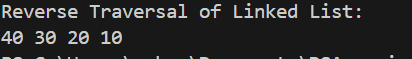

# Q.3 Write and implement the reverse traversal algorithm in the linked list. Write main() to demonstrate the use of the function.

# Data Structure:
We define a structure called Node which stores the value of data and the address of the next node. The 'data' stores the value and 'next' points to the next node.

# Function:
## 1. createNode(int value):
 We have a createNode(int value) function that is of type struct Node* used to create nodes in the linked list. It allocates memory for a new node and stores the data and the address of the next node. It returns a pointer to the new node.

 ## 2. insertEnd(struct Node * head, int value):
 We have a insertEnd() function that inserts the value to the end of the linked list. There is a while loop that runs till the next is not null and when a null value is found it stores the value of the new node at the end of the linked list.
 
 ## 3. reverseTraverse(struct Node* head):
  To implement the reverse traversal algorithm we define reverseTraverse(struct Node* head) function. It prints the linked list in the reverse order using recursion. It recursively calls and go to the next node first and once the recursion reaches the ends it prints the node values while returning from recursion. 

# In main():
In the main() function, we have created nodes with values 10, 20, 30 and 40. The link nodes form a singly linked list: 10->20->30->40->NULL. Then, reverseTraversal(head) function is called to print the elements int reverse.

# Output:
