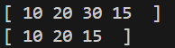

# Q.4 How can we implement the doubly linked list using structure? Write a method to insert(after given node) and delete the node in doubly linked list. Write main() to demonstrate the use of the functions.

# Data Structure:
In this C program, we have defined a structure called node. This node contains 'data' that stores integer value, 'next' that points to the next node and 'prev' that points to the previous node.

# Functions:
## 1. displayList():
The displayList() function prints all the elements in the list. It traverses from head to the end using next pointers. If list is empty it prints "Empty list". 

## 2. insertEnd(int value):
The insertEnd(int value) function adds a new node at the end with the given value. If list is empty it  makes it the head. Else traverses to the last node and links it and sets 'prev' pointer of new node to the previous last node. 

## 3. insertAfterNode(Node* pre, int value):
The insertAfterNode(Node* pre, int value) inserts a new node after a given node. It takes a pointer to an existing node. Then, it creates a new node and insert it between 'pre' and 'pre->next'. Then, it updates both next and prev pointers to maintain doubly linked sturcture.

## 4. deleteNodeByValue(int value):
The deleteNodeByValue(int value) function deletes the first node with given value. First, it searches for the node containing the value and once found, it adjusts pointers to bypass the node. Then, it updates 'prev' pointr of the next node and frees the memory of deleted node.

# In main():
First, we insert 10 and 15 into the linked list by using the insertEnd() function. List: [ 10, 15]. Then, we insert 20 and 30 into the list between 10 and 15. List: [ 10, 20, 30 ,15 ]. Then, we call the displayList() function to display the elements of linked list. Then, we delete the value 30 using the deleteNodeByValue() function and again display the elements.

# Output:
