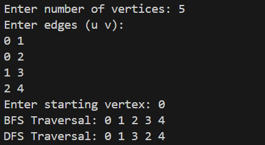

# How can we implement the undirected graph using adjacency matrix? Write a function that implement the BFS and DFS technique to traverse through the graph. Demonstrate the use of your program with example graph.

# Data Structure:
We have defined a MAX value that gives the maximum number of vertices the graph can have. The 'adj[MAX][Max]' represents the adjacency matrix. The 'visited[MAX]' keeps track of which vertices have already been visited. And 'n' stores the number of vertices in the graph.

# Functions:
## 1. BFS(int start):
This function uses queue because BFS works level by level. The 'front' points to the first element and the 'rear' points to the last element. Initially, no vertex is visited then, the starting vertex is added to the queue and marked as visited. A traversal loop is run that removes a vertex from the queue and print it. Then, it checks all vertices adjacent to 'v'. If there is an edge, the vertex is not visited then, it is added to the queue and marked as visited. This ensures all neighbours are visited before going deeper.

## 2. DFS(int v):
This function prints the current vertex and marks it as visited. It uses recursive function. For each adjacent vertex, if not visited it recursively calls DFS. DFS goes as deep as possible before backtracking.

# In main():
The variable 'edges' is declared to store the number of edges. The 'u' and 'v' gives the vertices forming and edge. 'start' is used to store the starting vertex for traversal. First we take the number of vertices and number of edges inputs from the user. Then, we initialize the adjacency matrix and enter the edges. Then, the BFS() function is called that traverses graph using BFS. Then, we reset the visited[] to zero for the DFS() function to work. Then, DFS() is called that traverses the graph using DFS.

# Output:
