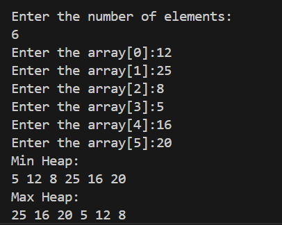

# Given the array of the data (unsorted), Write a program to build the min and max heap.

# Data Structure:
In this program, we have used array representation of heap. A heap is a complete binary tree that satisfies the heap property. We have defined two types of heap and they are min-heap and max-heap. The min-heap wil have it's parents node value less than the child node values and the root always contain the minimum element whereas it's the exact opposite for the max-heap. 

# Functions:
## 1. swap(int *a, int *b):
This function swaps two integer values using pointers. It uses a temporary variable "temp" to hold one value during swap.

## 2. void minHeapify(int arr[], int n, int i):
This function maintains the min-heap property starting from node i. It ensures parent nodes are smaller than or equal to child nodes. If a child is smaller it swaps it with the smallest child. It recursively fiexes the heap downward.

## 3. void maxHeapify(int arr[], int n, int i):
This function maintains the max-heap property starting from node i. It  ensures parent nodes are larger than or equal to child nodes. It works similarly to minHeapify but compares for larger values.

## 4. void buildMinHeap(int arr[], int n):
This function builds a complete min-heap from an unsorted array. It starts from the last non-leaf node (index n/2 - 1) and moves upward. Calls minHeapify on each node.

## 5. void buildMaxHeap(int arr[], int n):
This function builds a complete min-heap from an unsorted array. It follows the same logic as buildMinHeap() but uses maxHeapify.

## 6. void printHeap(int arr[], int n):
This function prints all elements of heap.

# In main():
Initially, the program asks the user for the total number of elements for the array and the elements for the array. We have created two copies of the input array: minHeap and maxHeap. Then, we call the function buildMinHeap() on the minHeap array and the buildMaxHeap() on the maxHeap array. Finally, we print the min-heap and max-heap array.

# Output:
