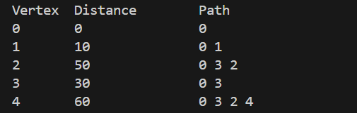

# Q.7 Given a weighted graph, implement Dijkstra’s algorithm to find the shortest path from a source node to all other nodes.

# Data Structure:
In this program, we have used an adjacency matrix to represent the graph. It stores the weight of edge and puts value 0 if no edge exists. It allows direct access to check if two vertices are connected. We have a distance array that stores the shortest distance from source to every vertex. We also have a visited array that keeps track of nodes which has already been processed.

# Functions:
## 1. int findMin(int dist[], int visited[]):
This function finds the unvisited vertex with smallest distance. It loops through all vertices and chooses the smallest 'dist[i]' where 'visited[i]==0'.

## 2. void printPath(int parent[], int j):
This function prints the shortest path using recursion. It goes back through parents until source is reached. Then prints forward.

## 3. void dijkstra(int graph[V][V], int source):
This function is the main algorithm. First, we initialize all the variables. Then, we have a main loop which picks the closest node and mark it as visited. Finally, we have a relaxation step that checks if path through u is shorter and if yes then it updates the distance and parent.

# In main():
In the main(), we have define a 5*5 adjacency matrix representing the graph. Then, we call the dijkstra() function with source = node 0 that finds and prints the shortest path.

# Output:
