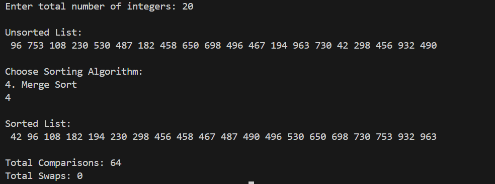

# Q.8 Write a program that generates a list of N random integers in the range [1, 1000], where N is provided by the user at run time. Then, perform the following tasks:  (a) Ask the user to choose a sorting algorithm from the following:  • Bubble Sort  • Selection Sort  • Insertion Sort  • Merge Sort  (b) Sort the randomly generated numbers using the chosen algorithm.  (c) Print the numbers before and after sorting.  (d) Display the total number of comparisons and swaps (if applicable) performed by the chosen algorithm.

# Data Structure:
In this program, we have used array as our main data structure. An array called 'arr' has been defined to store the list of N random integers. 'Comparisons' and 'swap' variable is used to measure the algorithm performance. They keep the count of the number of swaps and comaparisons made by the algorithm.

# Functions:
## 1. void printList(int arr[], int n):
This function is used to print the elements of the array.

## 2. void bubbleSort(int arr[], int n, int *comp, int *swaps):
This function is used to sort the data using the bubble sort algorithm. Bubble Sort is a simple comparison-based sorting algorithm where adjacent elements are compared, and they are swapped if they are in the wrong order.

## 3. void selectionSort(int arr[], int n, int *comp, int *swaps):
This function is used to sort the data using the selection sort algorithm. Selection Sort is a simple comparison-based sorting algorithm. It divides the array into two parts: a sorted portion and an unsorted portion. It repeatedly selects the smallest element from the unsorted portion and places it at the beginning of the sorted portion.

## 4. void insertionSort(int arr[], int n, int *comp, int *swaps):
This function is used to sort the data using the insertion sort algorithm. Insertion Sort is a simple sorting algorithm that builds the sorted array one item at a time by comparing each new element with the sorted portion and inserting it in its correct position.

## 5. void merge(int arr[], int l, int m, int r, int *comp):
This function combines two sorted halves into one sorted array. It is used in the merge sort array.

## 6. void mergeSort(int arr[], int l, int r, int *comp):
This function is used to sort the data using the merge sort algorithm. Merge sort is a sorting algorithm that follows the divide-and-conquer approach. It works by recursively dividing the input array into smaller subarrays and sorting those subarrays then merging them back together to obtain the sorted array.

# In main():
First, the user enters the number of elements. Then, we generate the random numbers and print the unsorted list. We ask the user to choose an algorithm to sort the list with. Using switch we call the function based on the user choice and finally print the sorted list with the algorithm performance.

# Output:
